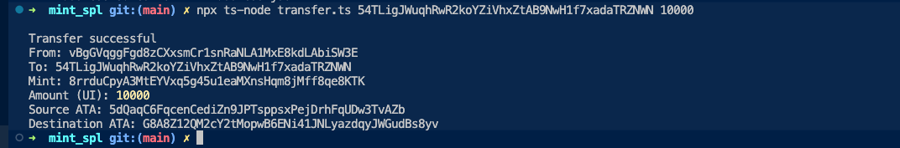
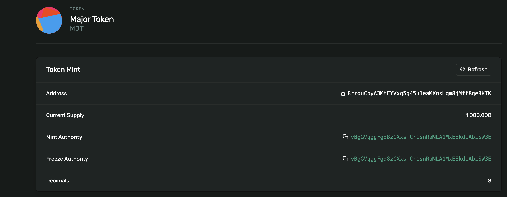

# SPL Token Mint

A simple project for creating and managing SPL tokens on Solana devnet using Metaplex.

## What it does

1. **Create Wallet** (`wallet.ts`) - Generates a new Solana wallet and requests an airdrop
2. **Mint Tokens** (`mint.ts`) - Creates a new SPL token with metadata (name, symbol, image) and mints tokens to your wallet

## Commands

### Create Wallet
```bash
npx ts-node wallet.ts
```

### Mint Tokens
```bash
npx ts-node mint.ts
```

**Hash of mint**: `8rrduCpyA3MtEYVxq5g45u1eaMXnsHqm8jMff8qe8KTK`



